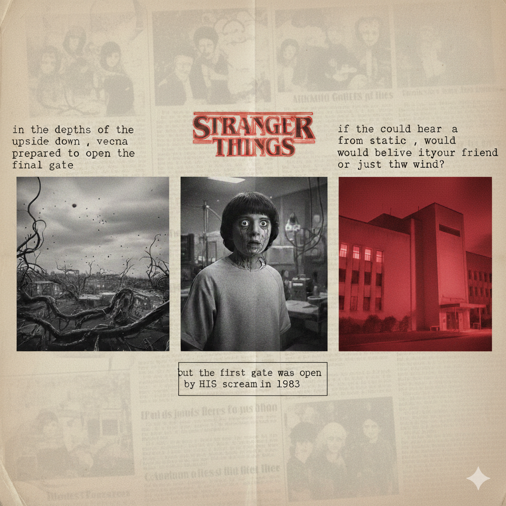

# ⚡ Ai-flash

> A Stranger Things–inspired creative AI experiment — images, video, and interactive web pages, all generated through iterative prompting.

---

## 🖼️ Gallery

<p align="center">
  
</p>
<p align="center">
  
</p>
<p align="center">
  
</p>

---

## 🎬 Video

https://github.com/koshal50/Ai-flash/blob/main/Generating_Cinematic_Nightmare_Footage.mp4

---

## 🌐 Interactive Pages

| Page | Description |
|------|-------------|
| [`ai.html`](ai.html) | Animated red-blue gradient with glowing center line — Power · Connection · Story |
| [`ai2.html`](ai2.html) | Timeline with oval pebbles, snake animation, and scroll-reveal cards |
| [`story.html`](story.html) | Full storyline website combining all images, video, and HTML pages |

---

## 📸 Screenshots

<p align="center">
   
</p>
<p align="center">
   
</p>
<p align="center">
   
</p>

---

## 🧠 Prompt History

### 1 · Stranger Things Triptych Newspaper Collage

> **Output →** `Gemini_Generated_Image_v1u7w3v1u7w3v1u7.png`

<p align="center">
  
</p>

```json
{
  "model": "nano banana",
  "prompt": "A triptych collage photograph displayed on a textured, dull off-white newspaper page background. The image is strictly divided into three vertical columns. \n\n[MIDDLE COLUMN]: At the very top, the retro red glowing 'Stranger Things' title logo. Directly below the logo is a grainy, printed photograph of young Will Byers, front profile view, looking terrified while wearing a hospital gown inside a dimly lit laboratory room. Below Will's photo, a block of printed typewriter text reads exacty: 'but the first gate was open by a scream in 1983'. \n\n[LEFT COLUMN]: At the top, a block of printed typewriter text reads exactly: 'in the depths of the upside down , vecna prepared to open the final gate'. Below the text is a landscape photograph of the town of Hawkins being overtaken by dark vines and spores of the Upside Down, but the sky above the town is surprisingly normal, dull, grey, and overcast, not red. \n\n[RIGHT COLUMN]: At the top, a block of printed typewriter text reads exactly: 'if you could hear a voice from static , would you believe itsyour friend or just thw wind?'. Below the text is a photograph of the exterior building of Hawkins National Laboratory heavily bathed in ominous, intense red light."
}
```

---

### 2 · Cinematic 80s Horror — Villain Emerging from the Rift

> **Output →** `Gemini_Generated_Image_emczg9emczg9emcz.png`

<p align="center">
  
</p>

```json
{
  "prompt": "A cinematic, low-angle shot in the style of 1980s sci-fi horror. A terrifying, humanoid villain made of dark, twisted vines and wet flesh is physically stepping out of a massive, glowing red rift that tears across the entire width of a concrete laboratory wall. The room is dark and filled with floating ash and blue spores. In the foreground, with their backs to the camera, two brave teenage girls stand ready to fight, facing the monster. One girl has short buzzed hair, the other has long red hair. On the floor, there are exactly two unconscious security guards lying defeated: one lying near the monster's feet by the wall, and one lying closer to the girls. High contrast, ominous red and blue lighting, hyper-realistic, 8k resolution."
}
```

---

### 3 · Animated HTML Page — Power · Connection · Story

> **Output →** [`ai.html`](ai.html)

<p align="center">
   
</p>

```
Create a HTML page with following UI characteristics:
- Background is gradient with red-blue changing from time to time from blue to red
  and vice-versa (the change was horizontally fade-in)
- There is a vertical angelic-white glowing line with smooth edges from top to bottom.
  The ends of the line were very smooth and fading away with glow
- On the left side of line, "Power" written in white colour with a glow,
  1 finger distance from top
- On the right side of the line, "Connection" written in red colour with same glow,
  1 finger distance from top
- On the line, 3 cms from bottom, "Story" written in blue colour such that
  the line cuts the word from center — appearing letter-by-letter and fading away
- Font size: INTER-SMALL
- Colors on the dull-dark side
```

---

### 4 · Timeline with Pebbles & Snake Animation

> **Output →** [`ai2.html`](ai2.html)

<p align="center">
   
</p>

```
To the previous HTML page, do these changes:
- Instead of the center vertical line, a line of oval pebbles (very short in height)
  with width 2×height and 1 finger space between them
- From time to time a red line comes lingering like a snake from top to bottom,
  passing through each pebble in a snake-like fashion
- "Power" is heading of "The beginning of something strange"
- "Connection" is heading of "Bonds formed in darkness"
- Cards below Power: "Story" → "The narrative unfolds", "Fracture" → "The world splits apart"
- Cards below Connection: "Reality" → "Truth becomes uncertain", "Upside Down" → "Nothing will be the same"
- Cards become visible one by one as you scroll downwards
```

---

### 5 · Eleven vs the Nightmare — Image Generation

> **Output →** `ChatGPT Image Feb 9, 2026, 11_22_18 AM.png`

<p align="center">
  
</p>

```
The barrier didn't just break—it shattered like glass.

From the swirling eye of the red wormhole, a multi-limbed nightmare lunged into
the flickering light of the lab.

Eleven stood at the epicenter, her hands thrust forward as she channeled a
blinding sphere of blue kinetic fire to hold the beast at the threshold.

The air hummed with the sound of reality tearing at the seams.

Beside her, Mike knelt, clutching a makeshift power-source to boost the lab's
signal, his face a mask of terror and grit.

Every console sparked and died, leaving them with only one choice: win the fight
here, or let the Upside Down claim the memory of Hawkins forever.

Generate the image using this script given above
```

---

### 6 · Cinematic Nightmare Footage — Video Generation

> **Output →** `Generating_Cinematic_Nightmare_Footage.mp4`

https://github.com/koshal50/Ai-flash/blob/main/Generating_Cinematic_Nightmare_Footage.mp4

```
Generate a cinematic 8 second footage using the following prompt:

The lab melts away into a living nightmare—metal turning to flesh,
lights becoming pulsing veins.
Eleven strains to hold the creature back as the wormhole expands,
pulling reality apart.
The monster reshapes itself, its face flickering with distorted memories
of everyone Mike has lost.
His fear feeds the space, causing the ground to fracture into floating
fragments of Hawkins.
Eleven's blue energy weakens—not fighting a creature, but grief made real.
The monster steps back, smiling.
This isn't a battle anymore.
It's a test.
```

---

### 7 · Storyline Website — Combining Everything

> **Output →** [`story.html`](story.html)

<p align="center">
   
</p>

```
Create a storyline-like website using the contents in this folder.
The folder includes images, video, and HTML files — include and use all of them.
```

---

## 📁 File Structure

```
Ai-flash/
├── README.md
├── ai.html                  ← Prompt 3 output
├── ai2.html                 ← Prompt 4 output
├── story.html               ← Prompt 7 output
├── Gemini_Generated_Image_v1u7w3v1u7w3v1u7.png   ← Prompt 1 output
├── Gemini_Generated_Image_emczg9emczg9emcz.png    ← Prompt 2 output
├── ChatGPT Image Feb 9, 2026, 11_22_18 AM.png    ← Prompt 5 output
├── Generating_Cinematic_Nightmare_Footage.mp4     ← Prompt 6 output
├── Screenshot 2026-02-09 102155.png    ← ai.html
├── Screenshot 2026-02-09 105059.png    ← ai.html
├── Screenshot 2026-02-09 105332.png    ← ai2.html
├── Screenshot 2026-02-09 113048.png    ← ai2.html
├── Screenshot 2026-02-09 114053.png    ← story.html
└── Screenshot 2026-02-09 114348.png    ← story.html
```

---

<p align="center"><sub>Built with AI prompts · Stranger Things inspired · 2026</sub></p>